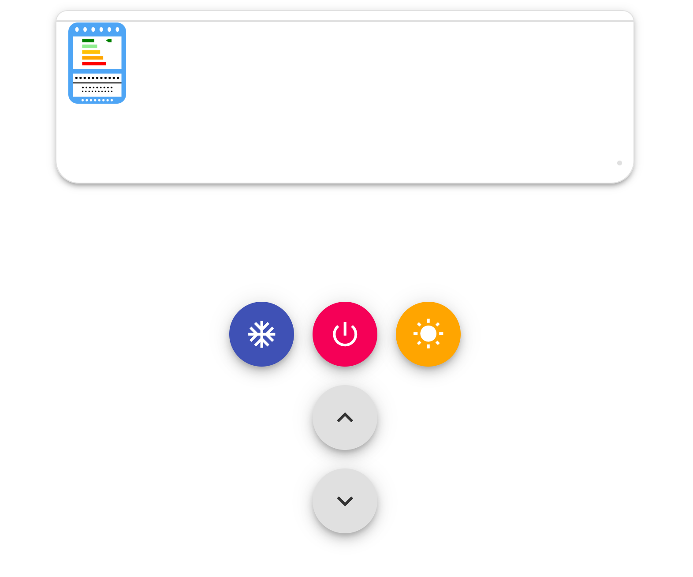

[简中](https://github.com/Anan-up/Portable-mini-air-conditioner/blob/main/README.md) | [文言](https://github.com/Anan-up/Portable-mini-air-conditioner/blob/main/README_Classical_Chinese.md) | [English](https://github.com/Anan-up/Portable-mini-air-conditioner/blob/main/README_English.md)

## Project Overview: Portable Mini AC for WeChat Moments

This is a **pure front-end, single-file fun web page** — a simulated air conditioner in the browser that can be **switched on/off, set to cooling/heating, and temperature-adjusted**, complete with button beeps and fan-wind sound. It belongs to the classic prank/meme genre that went viral in WeChat Moments (sending someone a link saying "It's hot — here's an AC for you"). All resources are embedded inline; it depends on no external server, so just double-click the file to play.

### Technical Composition

| Part | Implementation |
|---|---|
| Size | ~760 KB, single HTML file, **zero external requests** (verified by a full-text scan — no external links) |
| UI | The AC unit drawn in pure CSS + 3 animated "cold air" streams; button icons are inline SVGs (snowflake / power / sun / temperature up & down) |
| Digit font | A base64-embedded TTF font giving the temperature display a seven-segment digital look |
| Audio | 3 MP3 clips (button beep, ~9s startup sound, looping wind) embedded as base64 data URIs |
| State storage | `localStorage` persists mode and temperature for **30 days**; when localStorage is disabled (e.g. private mode), it automatically falls back to in-memory storage to prevent script crashes |

### Core Interaction Logic

- **Five buttons**: power, cooling ❄, heating ☀, temperature up, temperature down
- **Temperature range**: 16–31°C; adjusting temperature or switching modes does nothing while the unit is off (mimicking a real AC)
- **Seasonal defaults**: November through February defaults to heating at 28°C; other months default to cooling at 22°C — after the 30-day expiry, reopening the page resets to the seasonal default automatically
- On power on/off, the panel, indicator light, and airflow animation show/hide in sync

### The Most Crafted Part: The Wind-Sound Engine

The JS comments explicitly state it "replicates the original timing," and the implementation shows real care:

- Plays via the **WebAudio API**: after the startup sound plays for 7.5 seconds, the looping wind sound joins from its beginning; both the tail and head are wind noise, **overlapping by about 1.7 seconds** for a perceptually seamless transition
- The wind loops within the **0.5s–59s** window, skipping the initial attack
- On shutdown, the sound isn't cut off abruptly — it **fades out over 0.6 seconds**, followed by a short "beep"
- If `fetch`/`decodeAudioData` is unavailable, it falls back to plain `<audio>` + timers, and pre-loads by playing then pausing to eliminate the joining gap
- Audio is pre-decoded on page load, guaranteeing zero-latency button sounds

### project screenshot

